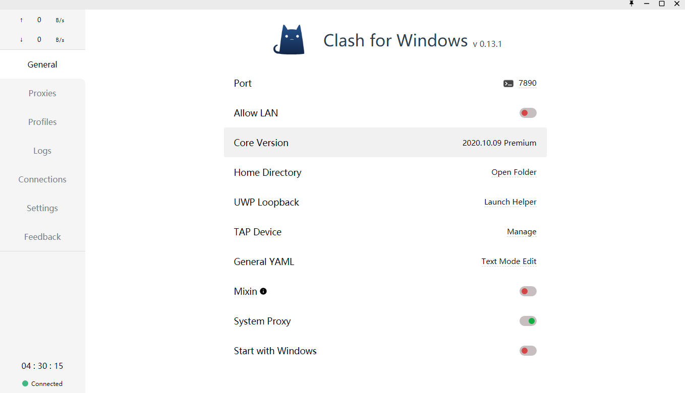
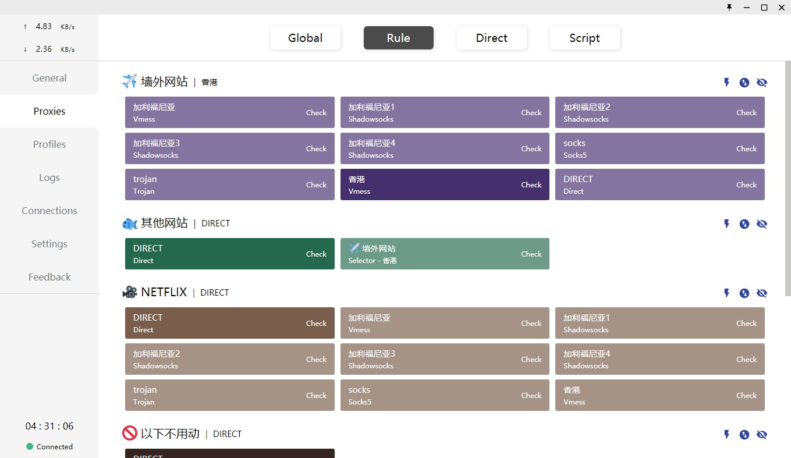
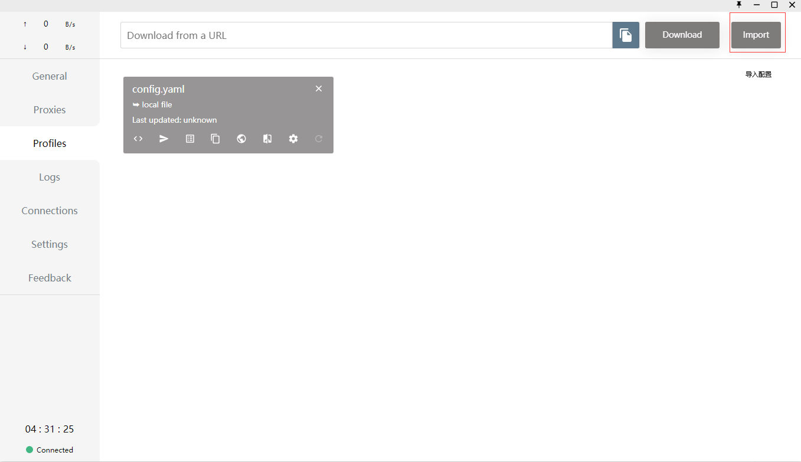
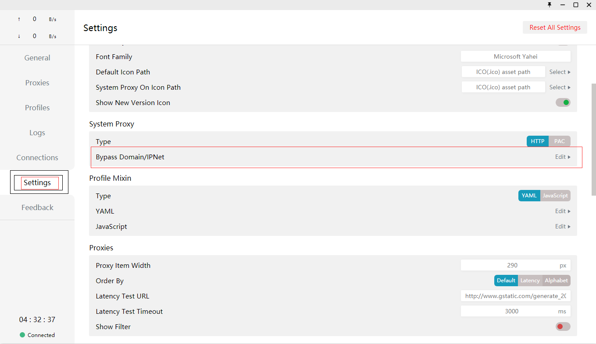
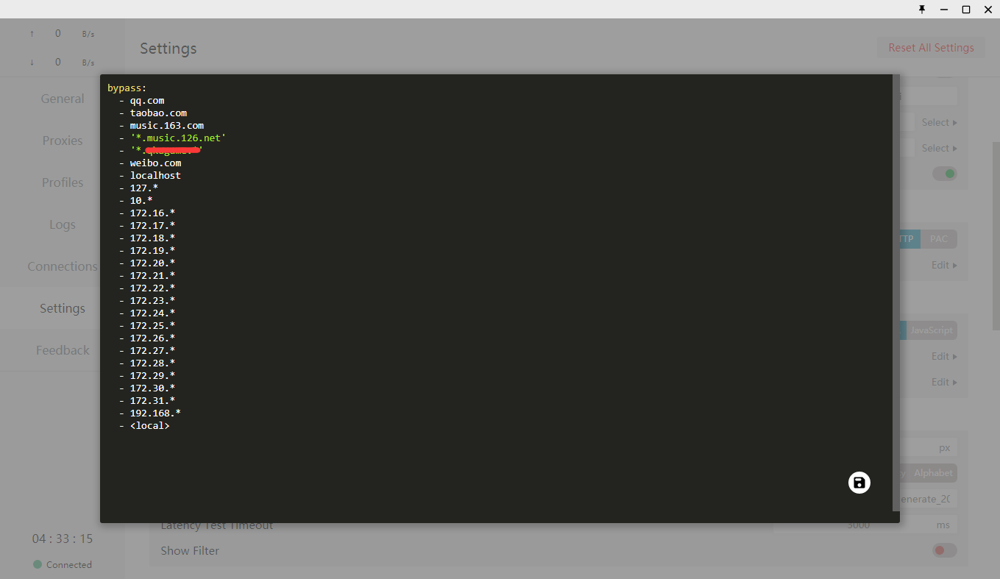

# clash 配置

## clash windows 客户端下载

```bash
https://github.com/Fndroid/clash_for_windows_pkg/releases 
# 下载完成双击安装
```

### 配置文件

* [clash 配置文件](./config.yaml)

# windows 配置







## clash Android 下载地址

```bash
https://github.com/Kr328/ClashForAndroid/releases
# config.yaml 用QQ 或者微信发送到手机导入就可以使用
```

### 说明

配置支持版本 windows Android 最新版本 就版本可能不支持配置

### 规则

```bash
https://github.com/Loyalsoldier/clash-rules
```
