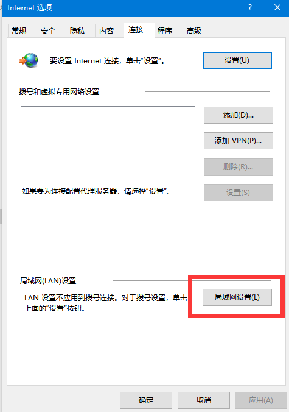
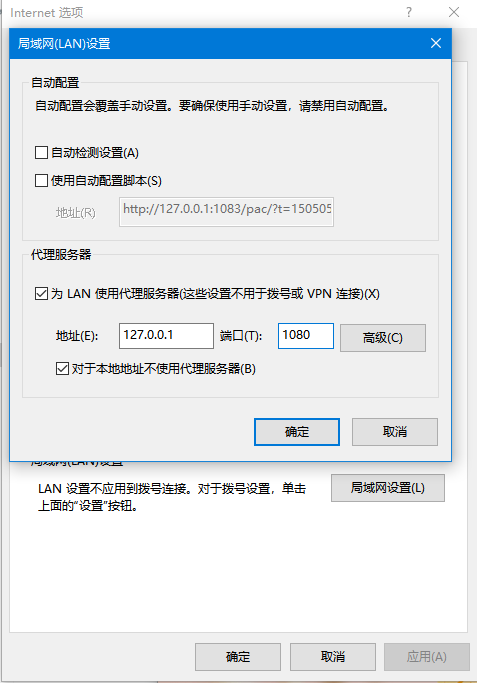

# trojan-go 服务端部署
```
下载地址：
cd /usr/local/src
https://github.com/p4gefau1t/trojan-go/releases
```
#### 解压 trojan-go
```
xz -d 下载对应版本名
tar -xvf  解压出来文件
# 复制文件到上级目录
cp -pdr trojan-go ../
```
#### 配置启动文件
```
### 方便 centos Ubuntu 使用
vim /etc/systemd/system/trojan-go.service

[Unit]
Description=trojan-go
Documentation=https://github.com/p4gefau1t/trojan-go
After=network.target network-online.target nss-lookup.target mysql.service mariadb.service mysqld.service

[Service]
Type=simple
StandardError=journal
ExecStart="/usr/local/trojan-go/trojan-go" -config "/etc/trojan-go/config.json"
ExecReload=/bin/kill -HUP $MAINPID
LimitNOFILE=51200
Restart=on-failure
RestartSec=1s

[Install]
WantedBy=multi-user.target
```
#### 配置 nginx
```
# 安装 nginx
yum install nginx \ apt install nginx
# 配置nginx
cd /etc/nginx/
vim nginx.conf
user  root;
worker_processes  1; # 配置cpu 数量
error_log  /var/log/nginx/error.log warn;
pid        /var/run/nginx.pid;
events {
    worker_connections 8192;
    use epoll;
}
http {
    include       /etc/nginx/mime.types;
    default_type  application/octet-stream;
    log_format  main  '$remote_addr - $remote_user [$time_local] "$request" '
                      '$status $body_bytes_sent "$http_referer" '
                      '"$http_user_agent" "$http_x_forwarded_for"';
    access_log  /var/log/nginx/access.log  main;
    sendfile        on;
    #tcp_nopush     on;
    keepalive_timeout  120;
    client_max_body_size 20m;
    #gzip  on;
   include /etc/nginx/conf.d/*.conf;
}
# 生成trojan域名配置文件
mkdir conf.d
cd conf.d
# 创建 域名配置文件 这里用二级域名
vim xx.xxx.com.conf
    server {
        listen       80;
        server_name  xx.xxxx.com;
        root /usr/share/nginx/html;
        index index.php index.html index.htm;
        location / {
            root   /usr/share/nginx/html;
            index  index.php index.html index.htm;
        }
}
# 启动
systemctl start nginx
# 设置开机启动
systemctl enable nginx
# 查看启动状态
systemctl status nginx
```
### 配置 trojan
```
mkdir /etc/trojan-go
vim /etc/trojan-go/config.json
{
  "run_type": "server",
  "local_addr": "0.0.0.0",
  "local_port": 443, 
  "remote_addr": "127.0.0.1",
  "remote_port": 80,
  "log_level": 1,
  "log_file": "",
  "password": [
    "password" # 密码
  ],
  "disable_http_check": false,
  "udp_timeout": 60,
  "ssl": {
    "verify": true,
    "verify_hostname": true,
    "cert": "/etc/nginx/ssl/xx.xxxx.com/fullchain.crt",
    "key": "/etc/nginx/ssl/xx.xxxx.com/private.key",
    "key_password": "",
    "cipher": "ECDHE-ECDSA-AES128-GCM-SHA256:ECDHE-RSA-AES128-GCM-SHA256:ECDHE-ECDSA-AES256-GCM-SHA384:ECDHE-RSA-AES256-GCM-SHA384:ECDHE-ECDSA-CHACHA20-POLY1305:ECDHE-RSA-CHACHA20-POLY1305:DHE-RSA-AES128-GCM-SHA256:DHE-RSA-AES256-GCM-SHA384",
    "cipher_tls13": "TLS_AES_128_GCM_SHA256:TLS_CHACHA20_POLY1305_SHA256:TLS_AES_256_GCM_SHA384",
    "curves": "",
    "prefer_server_cipher": true,
    "sni": "",
    "alpn": [
      "http/1.1"
    ],
    "alpn_port_override": {
            "h2": 81
    },
    "session_ticket": true,
    "reuse_session": true,
    "plain_http_response": "",
    "fallback_addr": "127.0.0.1",
    "fallback_port": 80, # 一定要存在的端口
    "fingerprint": "firefox"
  },
  "tcp": {
    "no_delay": true,
    "keep_alive": true,
    "prefer_ipv4": false
  },
  "mux": {
    "enabled": true,
    "concurrency": 8,
    "idle_timeout": 60
  },
  "router": {
    "enabled": false,
    "bypass": [

    ],
    "proxy": [

    ],
    "block": [

    ],
    "default_policy": "proxy",
    "domain_strategy": "as_is",
    "geoip": "$PROGRAM_DIR$/geoip.dat",
    "geosite": "$PROGRAM_DIR$/geosite.dat"
  },
  "websocket": {
    "enabled": true,
    "path": "/apps",
    "hostname": "ocezs.tycng.com",
    "obfuscation_password": "",
    "double_tls": true,
    "ssl": {
      "verify": true,
      "verify_hostname": true,
      "cert": "/etc/nginx/ssl/xx.xxxx.com/fullchain.crt",
      "key": "/etc/nginx/ssl/xx.xxxx.com/private.key",
      "key_password": "",
      "prefer_server_cipher": false,
      "sni": "xx.xxxx.com",
      "session_ticket": true,
      "reuse_session": true,
      "plain_http_response": ""
    }
  },
  "shadowsocks": {
    "enabled": true,
    "method": "AES-128-GCM", # 加密 方式
    "password": "password" # 密码
  },
  "transport_plugin": {
    "enabled": false,
    "type": "",
    "command": "",
    "option": "",
    "arg": [

    ],
    "env": [

    ]
  },
  "forward_proxy": {
    "enabled": false,
    "proxy_addr": "",
    "proxy_port": 0,
    "username": "",
    "password": ""
  },
  "mysql": {
    "enabled": false,
    "server_addr": "localhost",
    "server_port": 3306,
    "database": "",
    "username": "",
    "password": "",
    "check_rate": 60
  },
  "api": {
    "enabled": false,
    "api_addr": "",
    "api_port": 0,
    "ssl": {
      "enabled": false,
      "key": "",
      "cert": "",
      "verify_client": false,
      "client_cert": [

      ]
    }
  }
}
# https 配置
# 安装 免费自动签名工具
curl  https://get.acme.sh | sh
# 签发证书
acme.sh --issue  -d xx.xxx.com  --nginx -k 4096
# 复制证书到nginx 使用目录
mkdir -p /etc/nginx/ssl/xx.xxxx.com
acme.sh --install-cert -d xx.xxxx.com  \
        --key-file /etc/nginx/ssl/xx.xxxx.com/private.key  \
        --fullchain-file /etc/nginx/ssl/xx.xxxx.com/fullchain.cer  \
        --reloadcmd "systemctl restart trojan-go"
# 设置开机启动
systemctl enable trojan-go
# 查看启动状态
systemctl status trojan-go
```
#### 客户端配置
# 下载trojan-go win 或者 linux 版本
* [客户端配置](./client.yaml)
## 第三方工具 使用 http socks5 连接
```
proxies:
  - name: "socks"
    type: socks5
    server: 127.0.0.1
    port: 1080
proxies:
  - name: "http"
    type: http
    server: 127.0.0.1
    port: 1080
```
* [第三方工具](../clash/README.md)
## windows 使用ie 代理

